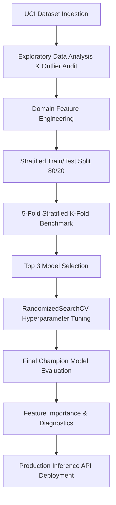

# 🍷 Wine Quality Classification & Predictive Modeling

[](https://www.python.org/)
[](https://scikit-learn.org/)
[](https://pandas.pydata.org/)
[](https://archive.ics.uci.edu/dataset/186/wine+quality)
[](LICENSE)

An end-to-end Machine Learning pipeline for predicting wine quality categories (*Low*, *Medium*, *High*) based on physicochemical properties of Portuguese *"Vinho Verde"* wines. This project encompasses comprehensive Exploratory Data Analysis (EDA), domain-specific feature engineering, multi-model benchmarking with Stratified K-Fold Cross-Validation, hyperparameter optimization via `RandomizedSearchCV`, detailed model interpretability analysis, and a production-ready inference API.

---


## 🔬 Overview

Wine quality evaluation traditionally relies on expensive sensory assessments by human experts. Automated physicochemical prediction models provide viticulturists and winemakers with an objective, data-driven framework to monitor fermentation, optimize acidity/sulfur balances, and grade wine batches consistently.

In this project, we analyze **6,497 red and white wine samples** from the UCI Machine Learning Repository to construct a robust multiclass classifier. The project tackles real-world ML challenges including **class imbalance**, **non-linear feature correlations**, and **hyperparameter optimization** across ensemble and non-ensemble classifiers.

---

## ✨ Key Features

- **Automated Data Ingestion**: Direct retrieval of official datasets via `ucimlrepo`.
- **Domain-Specific Feature Engineering**: Creation of chemical ratios (`total_acidity`, `sulfur_ratio`, `alcohol_density_ratio`, `sugar_acidity_ratio`) aligned with oenological domain knowledge.
- **Robust Outlier Management**: Data-driven outlier quantification using the Interquartile Range (IQR) method while preserving authentic extreme wine compositions.
- **Multi-Model Benchmark**: Evaluated **6 distinct algorithms** (Random Forest, Gradient Boosting, KNN, SVM, Logistic Regression, Decision Tree).
- **Class Imbalance Handling**: Utilized `StratifiedKFold` cross-validation, `Macro F1-Score` evaluation metrics, and class-weighted cost functions (`class_weight='balanced'`).
- **Hyperparameter Optimization**: Systematic grid tuning with `RandomizedSearchCV`.
- **Model Interpretability**: Permutation feature importance analysis and learning curves for diagnostic evaluation.
- **Production-Ready Inference**: Modular python function for real-time predictions on new laboratory samples.

---

## 📊 Dataset & Problem Formulation

### Source
- **Dataset**: UCI Wine Quality Dataset (ID: 186)
- **Creators**: Paulo Cortez et al. (2009), University of Minho, Portugal.
- **Domain**: Red and White Vinho Verde wine variants.

### Original Physicochemical Features

| Feature Name | Type | Description |
| :--- | :--- | :--- |
| `fixed_acidity` | Continuous | Non-volatile acids (e.g., tartaric acid) ($g/dm^3$) |
| `volatile_acidity` | Continuous | Amount of acetic acid ($g/dm^3$), high levels lead to vinegar taste |
| `citric_acid` | Continuous | Adds freshness and flavor to wines ($g/dm^3$) |
| `residual_sugar` | Continuous | Amount of sugar remaining after fermentation ($g/dm^3$) |
| `chlorides` | Continuous | Amount of salt in the wine ($g/dm^3$) |
| `free_sulfur_dioxide` | Continuous | Free form of $SO_2$ preventing microbial growth ($mg/dm^3$) |
| `total_sulfur_dioxide` | Continuous | Bound + free forms of $SO_2$ ($mg/dm^3$) |
| `density` | Continuous | Density of wine relative to water ($g/cm^3$) |
| `pH` | Continuous | Describes acidity/alkalinity level (0 to 14 scale) |
| `sulphates` | Continuous | Wine additive contributing to $SO_2$ levels ($g/dm^3$) |
| `alcohol` | Continuous | Percent alcohol content (% vol.) |

### Domain Feature Engineering

To capture complex chemical interactions, four domain-engineered features were derived:

1. **Total Acidity**: $\text{fixed acidity} + \text{volatile acidity} + \text{citric acid}$
2. **Sulfur Dioxide Ratio**: $\frac{\text{free sulfur dioxide}}{\text{total sulfur dioxide} + 1}$
3. **Alcohol-to-Density Ratio**: $\frac{\text{alcohol}}{\text{density} + 10^{-6}}$
4. **Sugar-to-Acidity Ratio**: $\frac{\text{residual sugar}}{\text{fixed acidity} + 1}$

### Target Classification Strategy

Sensory quality scores (originally integers from 3 to 9) were converted into 3 balanced, actionable quality tiers:

$$\text{Quality Tier} = 
\begin{cases} 
\mathbf{Low} & \text{if } \text{quality} \le 5 \\ 
\mathbf{Medium} & \text{if } \text{quality} = 6 \\ 
\mathbf{High} & \text{if } \text{quality} \ge 7 
\end{cases}$$

---

## 🛠️ Machine Learning Pipeline



1. **Preprocessing**: Handled non-missing values, validated feature distributions, and preserved minority class signals.
2. **Data Splitting**: 80/20 Train-Test split stratified by target categories (`random_state=42`).
3. **Validation**: 5-Fold `StratifiedKFold` cross-validation to prevent target leakage and ensure generalization across class distributions.

---

## 📈 Model Benchmarks & Performance

### 1. Initial 5-Fold Cross-Validation Benchmark

Models were benchmarked across multiple metrics, prioritizing **Macro F1-Score** due to class imbalance:

| Rank | Model Algorithm | Mean Accuracy | Accuracy Std | Mean Macro F1 | Macro F1 Std | Mean Balanced Acc |
| :---: | :--- | :---: | :---: | :---: | :---: | :---: |
| 🥇 | **Random Forest** | **61.45%** | ±0.0167 | **0.5902** | ±0.0199 | 0.5766 |
| 🥈 | **Gradient Boosting** | **60.34%** | ±0.0102 | **0.5797** | ±0.0140 | 0.5678 |
| 🥉 | **K-Nearest Neighbors** | **56.42%** | ±0.0193 | **0.5550** | ±0.0208 | 0.5560 |
| 4 | Support Vector Machine | 55.76% | ±0.0097 | 0.5500 | ±0.0105 | 0.5978 |
| 5 | Logistic Regression | 54.89% | ±0.0106 | 0.5434 | ±0.0088 | 0.5869 |
| 6 | Decision Tree | 51.64% | ±0.0185 | 0.5096 | ±0.0206 | 0.5511 |

---

### 2. Hyperparameter Tuning Results

The top 3 candidate models underwent hyperparameter tuning using `RandomizedSearchCV` (3-Fold Stratified CV):

| Model Algorithm | Best CV Macro F1 | Key Tuned Hyperparameters |
| :--- | :---: | :--- |
| **Random Forest** | **0.5933** | `n_estimators`: 200, `max_depth`: 20, `min_samples_split`: 10, `min_samples_leaf`: 2, `max_features`: 'sqrt' |
| **Gradient Boosting** | **0.5819** | `n_estimators`: 200, `learning_rate`: 0.05, `max_depth`: 4, `min_samples_split`: 2, `min_samples_leaf`: 1 |
| **K-Nearest Neighbors** | **0.5741** | `n_neighbors`: 15, `weights`: 'distance', `p`: 1 |

---

### 3. Final Champion Model Performance

The **Tuned Random Forest Classifier** with balanced class weighting was selected as the final production model.

| Metric | Holdout Test Score |
| :--- | :---: |
| **Accuracy** | **65.98%** |
| **Macro F1-Score** | **0.6498** |
| **Balanced Accuracy** | **0.6503** |

---

### 4. Class-wise Classification Report

Detailed breakdown on the unseen holdout test dataset ($N = 1,064$ samples):

```text
              precision    recall  f1-score   support

         Low       0.71      0.74      0.73       397
      Medium       0.64      0.62      0.63       465
        High       0.59      0.59      0.59       202

    accuracy                           0.66      1064
   macro avg       0.65      0.65      0.65      1064
weighted avg       0.66      0.66      0.66      1064
```

---

## 🔍 Model Interpretability

Permutation Feature Importance analysis revealed the primary chemical drivers influencing wine quality predictions:

1. **Alcohol & Alcohol-Density Ratio**: Strongest predictor of quality tier; higher alcohol concentration strongly correlates with higher quality ratings.
2. **Volatile Acidity**: Critical inverse predictor; elevated acetic acid levels degrade quality scores.
3. **Sulphates & Free/Total $SO_2$ Ratios**: Key preservatives impacting microbial stability and flavor perception.

---

## 📁 Project Structure

```text
wine_classification/
├── Wine_Classification.ipynb   # Master End-to-End Jupyter Notebook
├── requirements.txt            # Project dependencies
└── README.md                   # Project Documentation
```

---

## ⚙️ Installation & Setup

### Prerequisites
- Python 3.8+
- Jupyter Notebook / JupyterLab or Google Colab

### Installation Steps

1. **Clone the Repository**
   ```bash
   git clone https://github.com/your-username/wine_classification.git
   cd wine_classification
   ```

2. **Create a Virtual Environment**
   ```bash
   python3 -m venv venv
   source venv/bin/activate    # On Windows: venv\Scripts\activate
   ```

3. **Install Dependencies**
   ```bash
   pip install -r requirements.txt
   ```

4. **Launch Jupyter Notebook**
   ```bash
   jupyter notebook Wine_Classification.ipynb
   ```

---

## 🚀 Quickstart & Production Inference

You can run predictions on new wine samples using the built-in production inference function in the .ipynb notebook.

---

## 💡 Key Technical Insights

- **Evaluation Metric Selection**: Using standard accuracy for imbalanced datasets can be misleading. Optimizing for **Macro F1-Score** ensured equal importance across all quality tiers (*Low*, *Medium*, *High*).
- **Domain Ratios Matter**: Incorporating chemical ratios such as `alcohol_density_ratio` improved decision boundary resolution between adjacent quality tiers (*Medium* vs *High*).
- **Ensemble Dominance**: Tree ensemble models (Random Forest and Gradient Boosting) consistently outperformed linear classifiers and SVM due to non-linear feature interaction thresholds.

---


## 📜 Citation & References

If you use this project or dataset in your work, please cite the original study:

```bibtex
@article{cortez2009modeling,
  title={Modeling wine preferences by data mining from physicochemical properties},
  author={Cortez, Paulo and Cerdeira, Antonio and Almeida, Fernando and Matos, Telmo and Reis, Jose},
  journal={Decision Support Systems},
  volume={47},
  number={4},
  pages={547--553},
  year={2009},
  publisher={Elsevier}
}
```

---

## 📄 License

Distributed under the MIT License. See `LICENSE` for more details.

---
